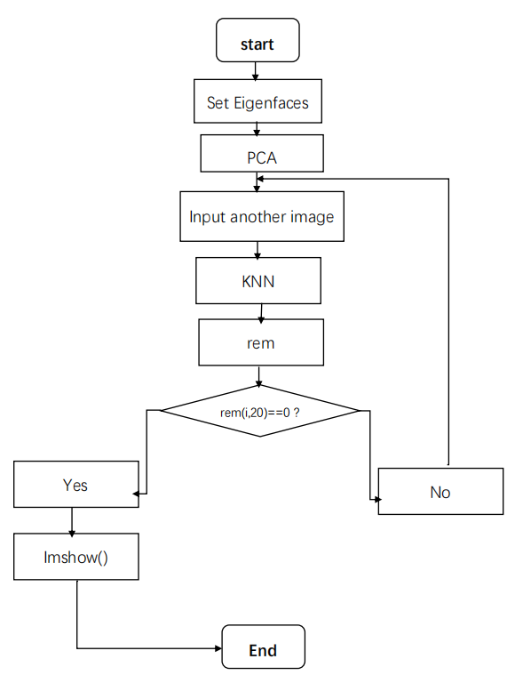
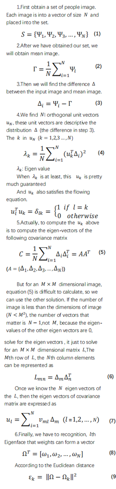
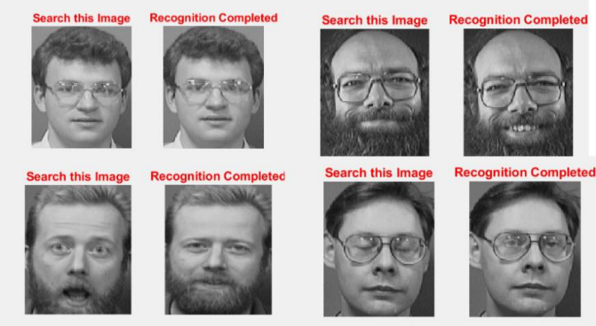

# Face Recognition with KNN in MATLAB

**Abstract**-This paper mainly focus the recognize a person’s identity is important mainly for security reason, but it could also be used to obtain quick access to medical, criminal, or any type of records. Solving this problem is important because it can protect everyone's personal information from being leaked.

**Index Terms**— MATLAB, Image Processing, Eigen Vector, Eigen Values, Euclidean Distance. Signal System, PCA, Image Recognition, Image Segmentation, KNN

### 1.INTRODUCTION
The idea for this paper came up while through gate of the campus and FaceID in Macbook or smartphone, mainly paper is based upon MATLAB comprising image processing. I had read different algorithms based on image processing like Adam’s algorithm, fisher face algorithm, Back Propagation Neural Network etc. But I will show the simplest way of implementing a face recognition system using MATLAB , Here no machine learning or Convolutional neural network (CNN) is required to recognize the faces. To keep the face recognition system as simple as possible, I used eigenvector based recognition system.

### 2.REQUIREMENTS
SYSTEM: CentOS 7.5.1804 Core (RHEL 7.x)

Kernel: x86_64 Linux 3.10.0-862.el7.x86_64

Shell: bash 4.2.46

CPU: Intel Core2 Duo P8600 @ 2x 

2.401GHz

RAM: 2358MiB / 3847MiB

GPU: Mesa DRI Mobile Intel® GM45 

Express Chipset

SOFTWARE: MATLAB R2018a

3.PROPOSED DESIGN OF MODEL

### 3.PROPOSED DESIGN OF MODEL

### 4.IMPLEMENTATION

### 5.RECOGNITION PROCEDURE
A face image is transformed into its eigen image components. Now according KNN ,we can realize face recognition.

### 6.MATLAB CODING
[Face_Recognition.m](coding/Face_Recognition.m)

[load_database.m](coding/load_database.m)

### 7.TEXT RESULT

### 8.LIMITATION
- 1.Large amount of calculation
- 2.Sample imbalance problem
- 3.Consume a lot memory

### 9.APPLICATION
- 1.FaceID in PC and phone
- 2.Door lock for person

### 10.CONCLUSION
First we input a image and observed the Euclidean distance that can tells us how close the input image from the image on set. Then according that we know the face whether know.

### 11.REFERENCES
[[1] International Journal of Scientific & Engineering Research, Volume 3, Issue 2, February 2012 5 ISSN 2229-5518](REFERENCES)
[[2]MIT University media laboratory, U](REFERENCES)
[[3]Olivetti Research Laboratory, UK](REFERENCES)